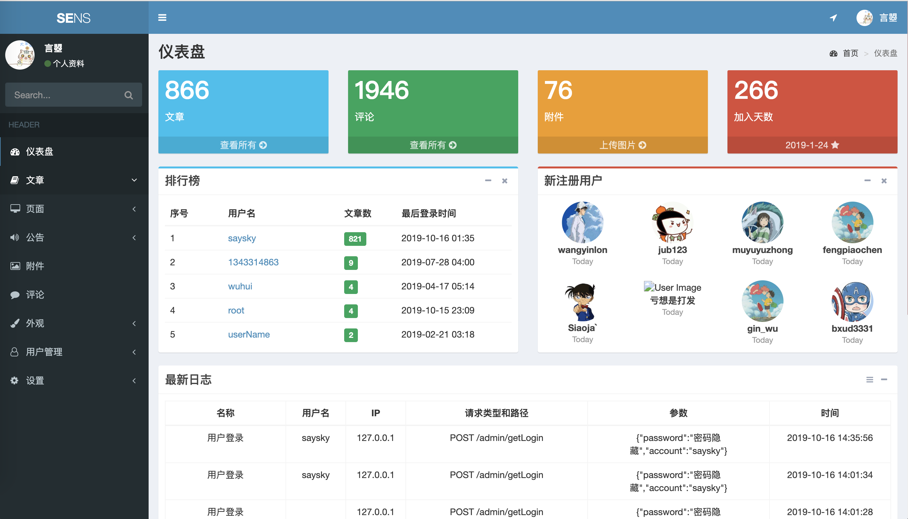
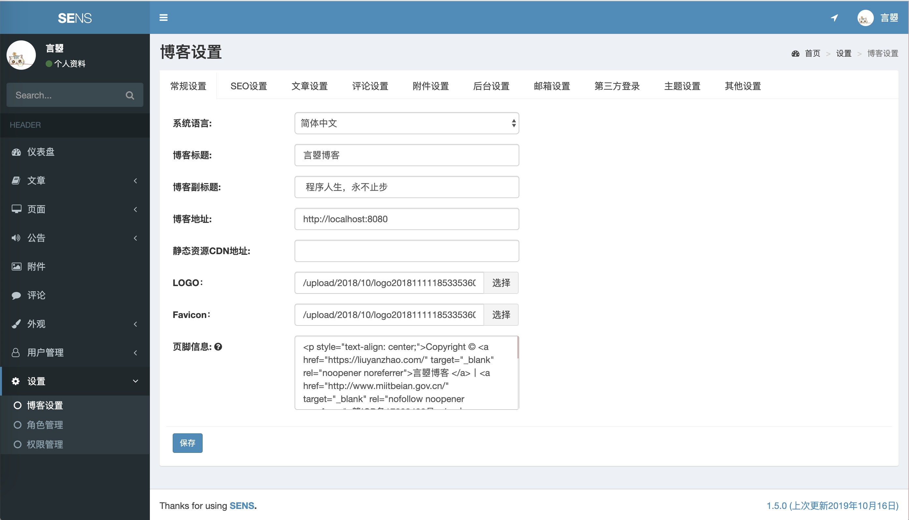
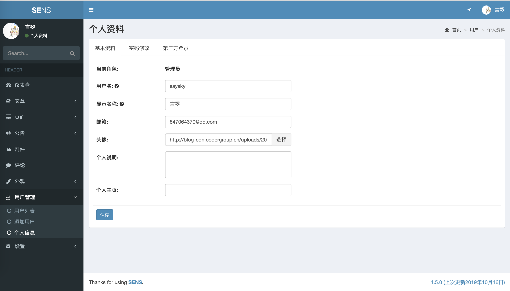
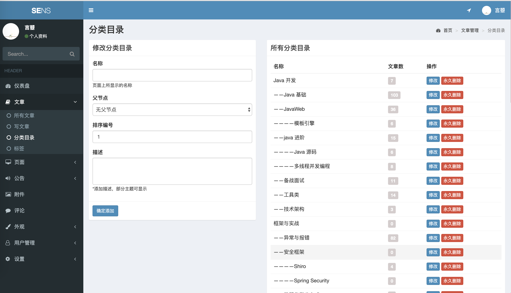

最新消息，SpringCloud 博客、音乐、商城、论坛系统开发中，开源，[sens-parent](https://github.com/saysky/sens-parent) 

最新轻量级SpringBoot+MyBatis+Thymeleaf博客系统  [初云博客-SpringBoot版本](https://github.com/saysky/ChuyunBlog)
# 关于项目
该项目是基于SpringBoot2.x+Shiro+Redis+ElasticSearch实现的博客系统。 
后台页面和部分功能借鉴并使用了Halo开源的早期版本代码 ，在此向其作者表示感谢！ 
因博主精力有限，重构计划一拖再拖，但是目标还是要有的：未来计划将后台采用vuejs，前台界面重新选择更加清新的模板。
预览地址：http://blog.liuyanzhao.com  
更新详细介绍：https://liuyanzhao.com/9354.html   

# 功能介绍
本博客系统基于 SpringBoot 2.x ，支持快速开发，部署，采用内置服务器 undertow (抛弃 tomcat)。

数据库采用常见关系型数据库 MySQL，ORM 框架是 MyBatis + MyBatis Plus。

采用 Redis 缓存数据，所有数据基本都先走 MySQL 然后走 Redis (部分分页数据和搜索数据除外)。

采用轻量级安全框架 Shiro，目前本站由三种角色(管理员，作者，订阅者)，也可以动态添加角色，并绑定权限，权限和后台菜单挂钩。

ElasticSearch 作为本站的站内搜索框架，支持分词检索数据和关键词高亮。

模板引擎采用 FreeMarker，为了考虑 SEO 没有使用 js 框架，后期会考虑将后台改为 Vue 实现，敬请期待。

前台页面还是一如既往的使用本站的模板页面，后台模板采用 AdminLte 的模板(基于BootStrap的)。

本站支持用户登录/注册，OAuth2.0 第三方登录。

# 页面预览

    

# 项目结构和数据库

# 关于开源
目前仅开源了后端代码，您可以学习SpringBoot2.x，Shiro，Redis等常见用法。
同时该项目已整合了ElasticSearch6.5，学有余力也可以看一下。
同时，这个项目时启动不起来的，因为缺少 Mapper xml 文件，所以说只适合阅读代码。
如果您需要完整版代码，请联系博主：847064370(QQ和微信)。

## 请喝一杯奶茶
请我喝一杯奶茶吧！
插条广告：博主最近有点时间，长期接毕设定制，软件定制，Java问题解决，带新人，一对一讲课等业务  
具体查看[有偿服务](https://liuyanzhao.com/bulletin/my-service)

